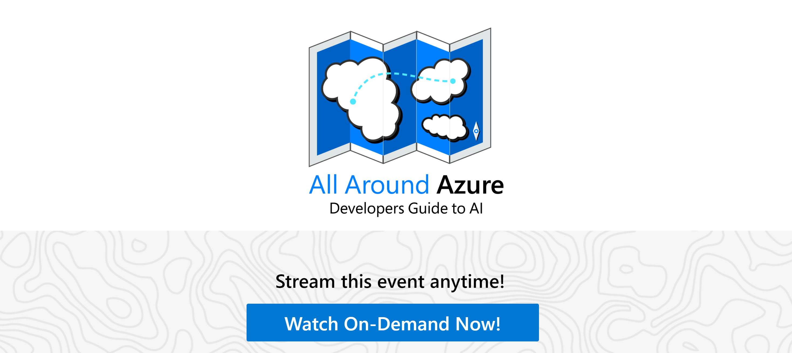

# All Around Azure: A Developer's Guide to AI

This repository contains a set of Azure AI Fundamental sessions and follow on resources. 
* Each session has a powerpoint presentation, including video demos and also a train-the-trainer video showing the content creator delivering the session (an idea of how you could deliver it)
* Given many of us are now delivering content online only - we understand that sessions need to be shortened compared to in-person conferences. Each sessions content is 15 - 20 mins duration + 10- 15 mins of Q&A recommeneded
* We also have carefully chosen the follow on resources. Therefore all sessions have one single link at the end. If an attendee of your session is inspired this one next step is where to go. All resources point towards [Microsoft Documentation](https://docs.microsoft.com/) and [Microsoft Learn modules](https://docs.microsoft.com/learn/).

This content was delivered during an **[All Around Azure - A Developer's Guide to AI](https://aka.ms/allaroundazure-ai)** on 18th November 2020 online in 3 time zones and 3 languages (Japanese, French and English). See the content in action using the links below:
* [All Around Azure - A Developer's Guide to AI (Japanese)](https://www.youtube.com/watch?v=rjtt6y_1Nak)
* [All Around Azure - A Developer's Guide to AI (French)](https://www.youtube.com/playlist?list=PL5Kprdw8GhxewNj_KmqMhmK0jOOzRQvZb)
* [All Around Azure - A Developer's Guide to AI (English)](https://channel9.msdn.com/Events/All-Around-Azure/All-Around-Azure-A-Developers-Guide-to-AI)

# Content Overview

### Title: A Developer's Guide to AI

### Abstract: 
Artificial Intelligence (AI) is driving innovative solutions across all industries but with machine learning (ML) applying a paradigm change to how we approach building products we are all exploring how to expand our skill sets and enhance our applications
Tailwind Traders is a retail company looking for support on how to benefit from applying AI across their business. In 'Developers Guide to AI’ we’ll show how Tailwind Traders have solved business challenges and implemented AI technologies.
In this learning path you will see a wide range of examples: dealing with different types of data (text, audio, image, unstructured), sharing best practices around unstructured search and conversational AI or taking your next step in learning more about machine learning theory with low code solutions.

## Relevant Certifications:
* [Exam AI-900: Microsoft Azure AI Fundamentals](https://aka.ms/ai900) 
* [Exam AI-100: Designing and Implementing an Azure AI Solution](https://aka.ms/ai100cert)

# Session List
* [AIML10 - Introducing Computer Vision for Automation in Changing Times](#session-code-aiml10)
* [AIML20 - Extracting Value from Text and Audio to Inform Business Strategy](#session-code-aiml20)
* [AIML30 - Making Sense of your Unstructured Data with AI](#session-code-aiml30)
* [AIML40 - Improve Customer Engagement and Productivity with Conversational AI](#session-code-aiml40)
* [AIML50 - Start Building Machine Learning Models Faster than You Think](#session-code-aiml50)
 

## Session Code AIML10
**Session Title:** Introducing Computer Vision for Automation in Changing Times

**Session Abstract:** In an effort to protect the wellbeing and safety of all employees during the global pandemic and promote social distancing, Tailwind Traders needed to reconsider its staffing model.  This has presented a challenge; quarterly inventory counts are happening in 4 weeks time and a reduction in staff means a longer inventory count period. 
In this session you will learn how Computer Vision was harnessed to address this opportunity and enable inventory counts to occur quicker to aid workers using Azure Cognitive services vision capabilities

**Key technologies included:** Cognitive Services Computer Vision, ONNX, Unity

**[Follow MS Learn Module](https://aka.ms/aiml10)**

**Resources to redeliver:**
* [Presentation](https://gaicstor2020.blob.core.windows.net/gaic-dgtai/AIML10-PRESENTATION/AIML10-%20Introducing%20Computer%20Vision%20for%20Automation%20in%20Changing%20Times_V2.pptx)
* [Speaker Notes](https://gaicstor2020.blob.core.windows.net/gaic-dgtai/AIML10-PRESENTATION/AIML10-presentation-speakernotes.docx)
* [Train-the-Trainer Video](https://gaicstor2020.blob.core.windows.net/gaic-dgtai/AIML10-VIDEOS/AIML10%20-%20Full%20Presentation.mp4)
* [Event Video and Q&A](https://channel9.msdn.com/Events/All-Around-Azure/All-Around-Azure-A-Developers-Guide-to-AI/Introducing-Computer-Vision-for-Automation-in-Changing-Times)

## Session Code AIML20
**Session Title:** Extracting Value from Text and Audio to Inform Business Strategy 

**Session Abstract:** Tailwind Traders have a great website and application for customers and partners. However, they are seeing an increased amount of support tickets regarding usage of these offerings. They want to store, analyse and extract insights from their text and audio data to make better product backlog decisions and reduce their support tickets. 
In this session you’ll learn how Tailwind Traders took their support ticket text and audio files, convert and extract insight metadata from each ticket using Azure Cognitive Services Text Analytics and Speech-to-Text. Then aggregated their findings to inform their product backlog and implement improvements.

**Key technologies included:** Azure Cognitive Services, Azure Storage and Power BI (Aspect Based Sentiment Analysis, Speech to Text, LUIS)

**[Follow MS Learn Module](https://aka.ms/aiml20)**

**Resources to redeliver:**
* [Presentation](https://gaicstor2020.blob.core.windows.net/gaic-dgtai/AIML20%20-%20PRESENTATION/AIML20%20-%20Extracting%20Value%20from%20Text%20and%20Audio%20to%20Inform%20Business%20Strategy.pptx)
* [Speaker Notes](https://gaicstor2020.blob.core.windows.net/gaic-dgtai/AIML20%20-%20PRESENTATION/AIML20-presentation-speakernotes.docx)
* [Train-the-Trainer Video](https://gaicstor2020.blob.core.windows.net/gaic-dgtai/AIML20-VIDEOS/dry-runs/All%20Around%20Azure%20-%20AIML20_%20Amanda%20Wong.mp4)
    * [Demo Video 1](https://gaicstor2020.blob.core.windows.net/gaic-dgtai/AIML20-VIDEOS/AIML20-Demo1.mp4)
    * [Demo Video 2](https://gaicstor2020.blob.core.windows.net/gaic-dgtai/AIML20-VIDEOS/AIML20-Demo2.mp4)
    * [Demo Video 3](https://gaicstor2020.blob.core.windows.net/gaic-dgtai/AIML20-VIDEOS/AIML20-Demo3.mp4)
    * [Demo Video 4](https://gaicstor2020.blob.core.windows.net/gaic-dgtai/AIML20-VIDEOS/AIML20-Demo4.mp4)
    * [Demo Video 5](https://gaicstor2020.blob.core.windows.net/gaic-dgtai/AIML20-VIDEOS/AIML20-Demo5.mp4)
* [Event Video and Q&A](https://channel9.msdn.com/Events/All-Around-Azure/All-Around-Azure-A-Developers-Guide-to-AI/Extracting-Value-from-Text-and-Audio-to-Inform-Business-Strategy)

## Session Code AIML30
**Session Title:** Making Sense of your Unstructured Data with AI

**Session Abstract:** Tailwind Traders have a lot of data often in unreadable formats such as Invoice PDFs, Product and Review images and inventory forms. They would like the ability to extract this rich information, analyze it and act on it.
In this session, you'll learn how the team use Azure Cognitive Search to make sense of this data in a short amount of time and with amazing success. We'll discuss AI concepts, like the ingest-enrich-explore pattern, skillsets, leveraging cognitive services, knowledge bases and connecting all these elements together to build an intelligent search experience into their applications.

**Key technologies included:** Azure Cognitive Search, Azure Cognitive Services, Azure Functions, Azure Storage

**[Follow MS Learn Module](https://aka.ms/aiml30)**

**Resources to redeliver:**
* [Presentation](https://gaicstor2020.blob.core.windows.net/gaic-dgtai/AIML30-PRESENTATION/AIML30%20-%20Making%20Sense%20of%20your%20Unstructured%20Data%20with%20AI.pptx)
* [Speaker Notes](https://gaicstor2020.blob.core.windows.net/gaic-dgtai/AIML30-PRESENTATION/AIML30-presentation-speakernotes.docx)
* [Train-the-Trainer Video](https://gaicstor2020.blob.core.windows.net/gaic-dgtai/AIML30-VIDEOS/AIML30-Full%20Presentation.mp4)
    * [Demo Video 1](https://gaicstor2020.blob.core.windows.net/gaic-dgtai/AIML30-VIDEOS/aiml30-demo1.mp4)
    * [Demo Video 2](https://gaicstor2020.blob.core.windows.net/gaic-dgtai/AIML30-VIDEOS/aiml30-demo2.mp4)
    * [Demo Video 3](https://gaicstor2020.blob.core.windows.net/gaic-dgtai/AIML30-VIDEOS/aiml30-demo3.mp4)
    * [Demo Video 4](https://gaicstor2020.blob.core.windows.net/gaic-dgtai/AIML30-VIDEOS/aiml30-demo4.mp4)
* [Event Video and Q&A](https://channel9.msdn.com/Events/All-Around-Azure/All-Around-Azure-A-Developers-Guide-to-AI/Making-Sense-of-your-Unstructured-Data-with-AI)

## Session Code AIML40
**Session Title:** Improve Customer Engagement and Productivity with Conversational AI

**Session Abstract:** Tailwind Traders recent internal employee survey showed their employees are frustrated with lengthy processes for simple actions, such as booking vacation and other company benefits. They want to reduce the friction of reviewing and booking vacation so it’s a simple, easy and pleasant process for their employees.
In this session you will see how Tailwind Traders applied Conversational AI best practices to simplify the vacation process for their employees. Using the Bot Framework Composer tooling you can quickly build conversation flows, incorporate intelligence services such as Q&A maker and LUIS, test and deploy your virtual assistant to the cloud and embed it where your customers and employees spend their time. 

**Key technologies included:** Bot Framework – Composer, Cognitive Services - Q&A Maker, Cognitive Services – LUIS, Azure Bot Service, Teams

**[Follow MS Learn Module](https://aka.ms/bfcomposer)**

**Resources to redeliver:**
* [Presentation](https://gaicstor2020.blob.core.windows.net/gaic-dgtai/AIML40-PRESENTATION/AIML40%20-%20Improve%20Customer%20Engagement%20and%20Productivity%20with%20Conversational%20AI.pptx)
* [Speaker Notes](https://gaicstor2020.blob.core.windows.net/gaic-dgtai/AIML40-PRESENTATION/AIML40-presentation-speakernotes.docx)
* [Train-the-Trainer Video](https://gaicstor2020.blob.core.windows.net/gaic-dgtai/AIML40-VIDEOS/AIML40-VIDEOS/AIML40-Full%20Presentation.mp4)
    * [Demo Video 1](https://gaicstor2020.blob.core.windows.net/gaic-dgtai/AIML40-VIDEOS/AIML40-VIDEOS/AIML40-DEMO1.mp4)
    * [Demo Video 2](https://gaicstor2020.blob.core.windows.net/gaic-dgtai/AIML40-VIDEOS/AIML40-VIDEOS/AIML40-DEMO2.mp4)
    * [Demo Video 3](https://gaicstor2020.blob.core.windows.net/gaic-dgtai/AIML40-VIDEOS/AIML40-VIDEOS/AIML40-DEMO3.mp4)
    * [Demo Video 4](https://gaicstor2020.blob.core.windows.net/gaic-dgtai/AIML40-VIDEOS/AIML40-VIDEOS/AIML40-DEMO4.mp4)
* [Event Video and Q&A](https://channel9.msdn.com/Events/All-Around-Azure/All-Around-Azure-A-Developers-Guide-to-AI/Improve-Customer-Engagement-and-Productivity-with-Conversational-AI)

## Session Code AIML50
**Session Title:** Start Building Machine Learning Models Faster than You Think

**Session Abstract:** Tailwind Traders are finding it difficult to accurately predict they inventory at their many different retail stores. They want to introduce custom machine learning models to help, without changing their Software Development Life Cycle. How? They are exploring Azure Machine Learning Designer. 
In this session, you’ll learn the data science process that Tailwind Traders’ uses and get an introduction to Azure Machine Learning Designer. You’ll see how to find, import, and prepare data, select a machine learning algorithm, train and test the model, and deploy a complete model to an API. Get tips, best practices, and resources you and your development team need to continue your machine learning journey.

**Key technologies included:** Azure Machine Learning Designer Jupyter Notebooks

**[Follow MS Learn Module](https://aka.ms/aiml50)**

**Resources to redeliver:**
* [Presentation](https://gaicstor2020.blob.core.windows.net/gaic-dgtai/AIML50%20-%20PRESENTATION/AIML50-Start%20Building%20Machine%20Learning%20Models%20Faster%20than%20You%20Think.pptx)
* [Speaker Notes](https://gaicstor2020.blob.core.windows.net/gaic-dgtai/AIML50%20-%20PRESENTATION/AIML50-presentation-speakernotes.docx)
* [Train-the-Trainer Video](https://gaicstor2020.blob.core.windows.net/gaic-dgtai/AIML50-VIDEOS/AIML50-VIDEOS/AIML50-Full-Presentation.mp4)
* [Event Video and Q&A](https://channel9.msdn.com/Events/All-Around-Azure/All-Around-Azure-A-Developers-Guide-to-AI/Start-Building-Machine-Learning-Models-Faster-than-You-Think)

# Contributing

TBC